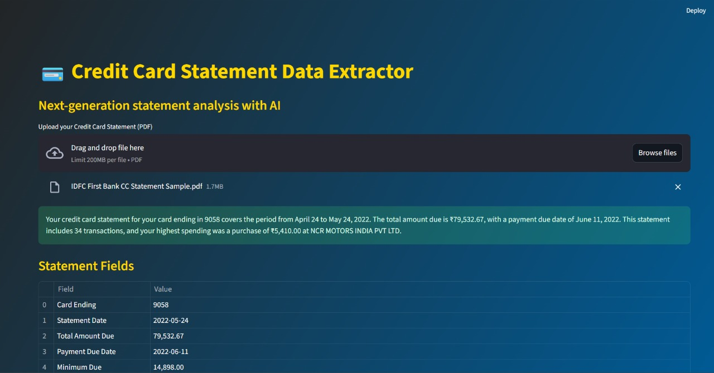
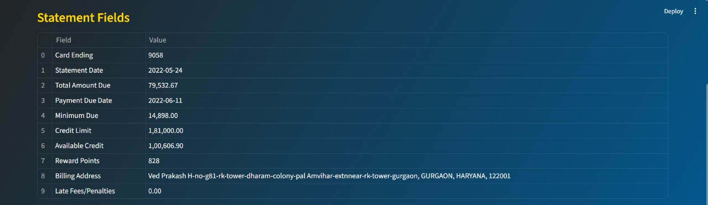
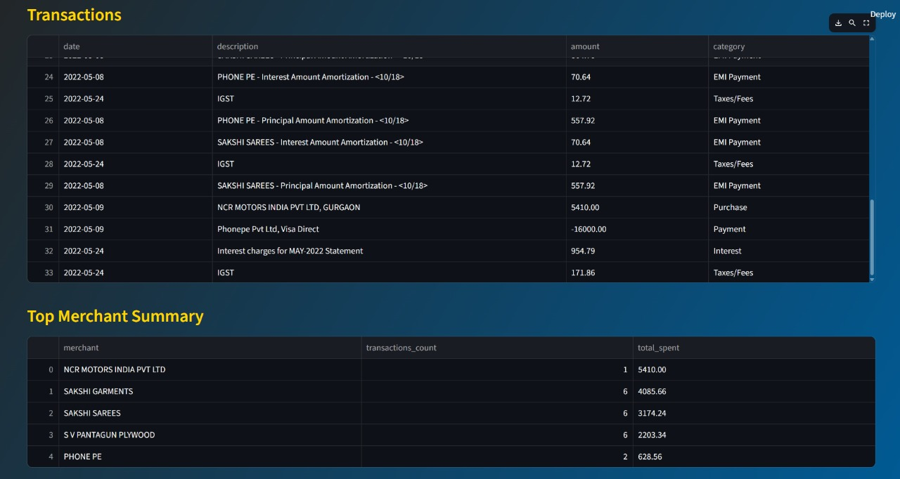
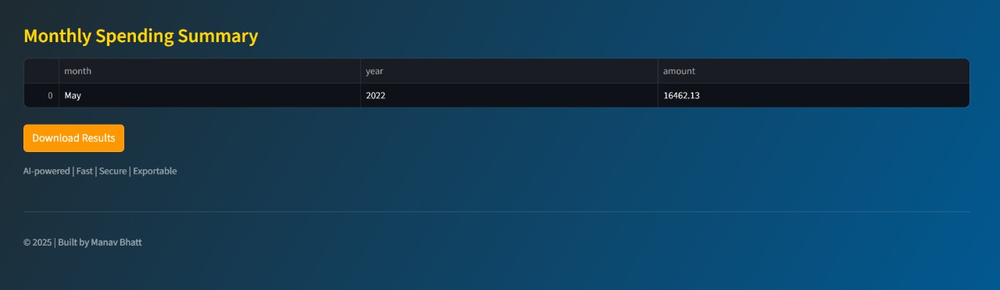

# 💳 Credit Card Statement Data Extractor

**AI-powered, lightning-fast extraction and professional export of credit card statement details straight from your PDF.**

---

## 🚀 Features

- **Instant PDF Analysis:** Drag, drop, and parse your credit card statements in seconds.
- **Gemini AI Integration:** Uses Google's latest Gemini AI to extract, summarize, and structure all essential statement data.
- **Detailed Data Extraction:**  
  - Card last 4 digits  
  - Statement date, total amount due, payment due date  
  - Minimum amount due, credit limit, available credit  
  - Reward points & billing address  
  - Late fees/penalties  
  - **Transaction Table:** All individual transactions (date, description, amount, category)  
  - **Merchant Summary:** Top merchants and totals  
  - **Spending Analytics:** Monthly spending summary
- **Human-Readable Summary:** Friendly summary section highlights what matters most.
- **One-Click Export:** Download transaction data as CSV or Excel – choose your preferred format in a beautiful dialog.
- **Modern UI:** Gradient dark theme, clear tables, and visual highlights for insights.
- **Secure by Design:** API keys handled via `.env`—never hardcoded.

---

## 🛠️ Setup

1. **Install Requirements**
```bash
pip install -r requirements.txt
```
2. **Set up Your Gemini API Key**  
Create a file named `.env` in your project directory:
```bash 
GEMINI_API_KEY=your_actual_gemini_api_key_here
```
3. **Start the App**
```bash
python -m streamlit run app.py
```

---

## 📊 How To Use

1. **Open in Browser:** After launching, open the local URL.
2. **Upload:** Drag and drop your statement PDF.
3. **Analyze:** Instantly see a summary, all statement fields, and in-depth tables.
4. **Export:** Click the “Download Results” button, then choose CSV or Excel.

---

## 📈 Example Output

| Field               | Value                       |
|---------------------|----------------------------|
| Card Ending         | 3458                       |
| Statement Date      | March 12, 2023             |
| Total Due           | ₹38,935.40                 |
| Minimum Due         | ₹8,935.40                  |
| Credit Limit        | ₹30,000.00                 |
| ...                 | ...                        |

**Transactions and merchant/top spend tables appear below the fields table.**

---


## 🖼️ Application Preview

**Main Dashboard**



**Table with statement fields**




**Transaction results and analytics**



---

## 🏆 Why Use This App?
- **Perfect for tracking expenses, tax time, or account audits.**
- **Removes the hassle of manual transcription.**
- **See your credit card data like never before.**

---

## ⚡ Dependencies

- streamlit
- google-generativeai
- python-dotenv
- pandas
- PyPDF2
- xlsxwriter

---

## 👨‍💻 Contributing

Open to pull requests and feature suggestions!  
Please file issues for bugs or new ideas.

---

## 📬 Contact

- Built by Manav Bhatt.
- Questions? Reach out via [LinkedIn](https://www.linkedin.com/in/manav-bhatt1409/) or [Twitter](https://x.com/ManavBhatt_1409).

---

**Turn your statements into insights, instantly.**
